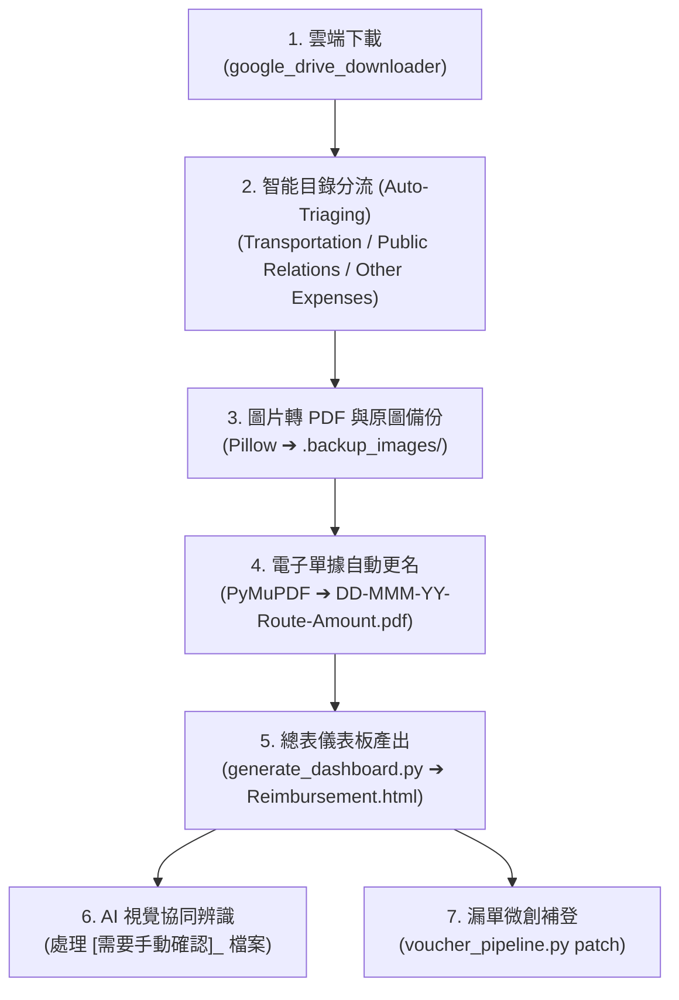

# 🚀 Voucher Pipeline Manager (出差報銷單據全自動化流水線總管)

> 📌 **核心使命**：**「即使所有歷史月份目錄全被清空，任何 AI 代理人進場依然能秒懂全自動處理流程，一鍵完成單據分流、辨識改名、微創補單與總表產出！」**

---

## 💀 屍前驗屍與五大硬性鐵律 (Pre-Mortem Invariants)

1. **【歷史解耦律 (History Independence)】**：
   - 嚴禁依賴任何既有月份（如 `Mar/`、`Apr/`）作為範例，所有規則、正規化正則（`^(\d{2})-([A-Za-z]{3})-(\d{2})-(.+)-(\d+)\.(pdf|jpg)$`）與分流邏輯 100% 內聚於本技能代碼與本規範中！
2. **【原圖安全備份律 (Zero Data Loss)】**：
   - 轉換圖片為 PDF 時，原始照片必須安全搬遷至該月份目錄下的 `.backup_images/`，絕對嚴禁原地刪除！
3. **【AI 視覺開眼與手動確認邊界防禦律 (Vision-First & Human Review Guard)】**：
   - **AI 代理人端到端負責**：純代碼管線雖會對圖片/掃描檔暫時標記 `[需要手動確認]_`，但 **AI 代理人在執行單據任務時，必須主動調用多模態視覺工具開眼檢視圖片**，辨識日期、店名與金額，並標準重命名！
   - **標記保留門禁**：嚴禁「連看都不看」就將標記扔給人類用戶。**只有當發票文字嚴重模糊、物理摺痕截斷、缺少總計金額、或視覺模型識別信心度顯著低於 85% 時**，才允許保留 `[需要手動確認]_` 請人類使用者裁決！
4. **【單一固定簽名律 (Command Hygiene)】**：
   - 全量管線：`py .agents\skills\voucher_pipeline_manager\scripts\voucher_pipeline.py "<月份資料夾名稱>"`。
   - 微創補單：`py .agents\skills\voucher_pipeline_manager\scripts\voucher_pipeline.py patch "<單據檔案路徑>" --month "<月份資料夾名稱>" --type <trans|pr|other>`。
5. **【微創補登零推倒律 (Incremental Patch Invariant)】**：
   - 面對後續補件、漏單場景，**嚴禁全局重新執行全量生成腳本推倒整個 HTML**！必須優先調用 `patch` 微創子指令：單點解析更名 ➔ 渲染垂直拼接預覽圖 ➔ 局部追加 `Reimbursement.html` 的 `defaultData` 陣列 ➔ 同步更新本地 `<月份>_Vouchers.json` 結構化總帳。

---

## 🚦 CLI 標準調用命令

```bash
# 模式 1：對指定月份資料夾執行全套管線處理 (自動分流 ➔ 圖片轉PDF ➔ 交通單據文字萃取命名 ➔ 生成 Reimbursement.html 與本地 JSON)
py .agents\skills\voucher_pipeline_manager\scripts\voucher_pipeline.py "Sep 2026"

# 模式 2：漏上傳單據「微創補登」 (不推倒整份 HTML，自動辨識、標準歸位、生成預覽圖、微創追加 defaultData 與本地 JSON)
py .agents\skills\voucher_pipeline_manager\scripts\voucher_pipeline.py patch "<單據檔案路徑>" --month "Sep 2026" --type trans
```

---

## 🧭 四大標準階段作業流程 (Standard SOP)



### 步驟 1：雲端拉取
調用專案下載技能：
```bash
py .agents\skills\google_drive_downloader\scripts\drive_downloader.py
```

### 步驟 2：執行全自動處理管線
```bash
py .agents\skills\voucher_pipeline_manager\scripts\voucher_pipeline.py "<月份資料夾>"
```

### 步驟 3：AI 代理人多模態開眼處理（若有未辨識單據）
若終端提示有 `[需要手動確認]_` 檔案（如餐飲發票或掃描檔）：
1. AI 代理人調用多模態視覺工具檢視該發票圖片內容。
2. 辨識出消費日期、地點/描述、實付金額。
3. 將檔案手動命名為標準格式（例如：`20-Sep-26-Client Dinner-2500.pdf`），移除標記。
4. 重新執行一次管線命令以刷新 `Reimbursement.html`。

### 步驟 4：漏單據補件場景（後續發現漏單）
直接調用微創補登指令，零損耗原地補入：
```bash
py .agents\skills\voucher_pipeline_manager\scripts\voucher_pipeline.py patch "<檔案路徑>" --month "<月份>" --type trans
```

---

## 📁 模組結構
 
- 核心流水線總管（含 patch 補單引擎）：[`scripts/voucher_pipeline.py`](file:///e:/Projects/Voucher%20management/.agents/skills/voucher_pipeline_manager/scripts/voucher_pipeline.py)
- 本地儀表板生成引擎（含 Vouchers.json 同步）：[`scripts/generate_dashboard.py`](file:///e:/Projects/Voucher%20management/.agents/skills/voucher_pipeline_manager/scripts/generate_dashboard.py)
